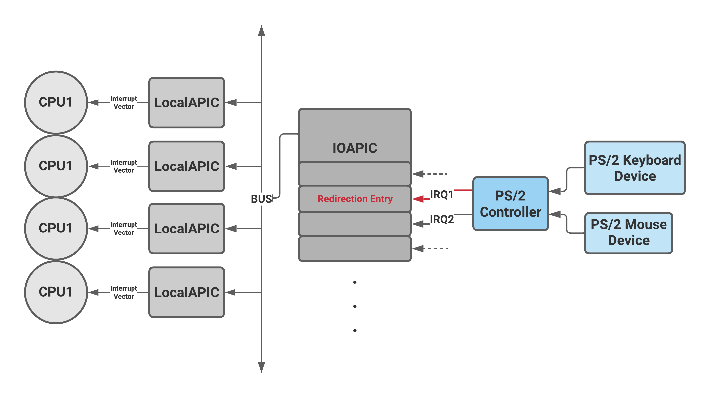
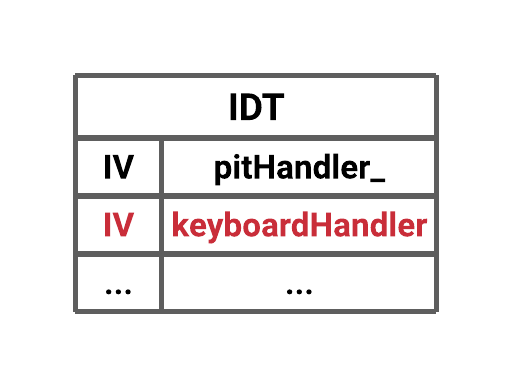
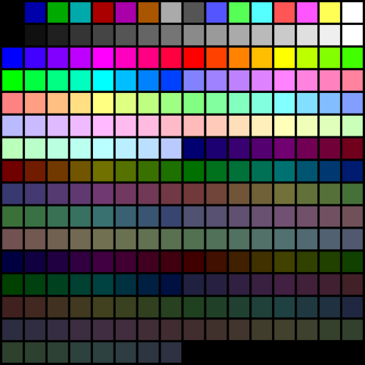
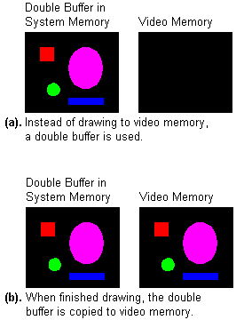
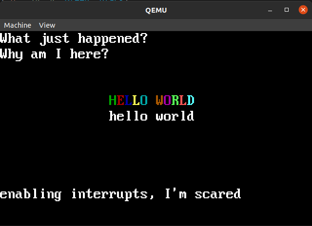
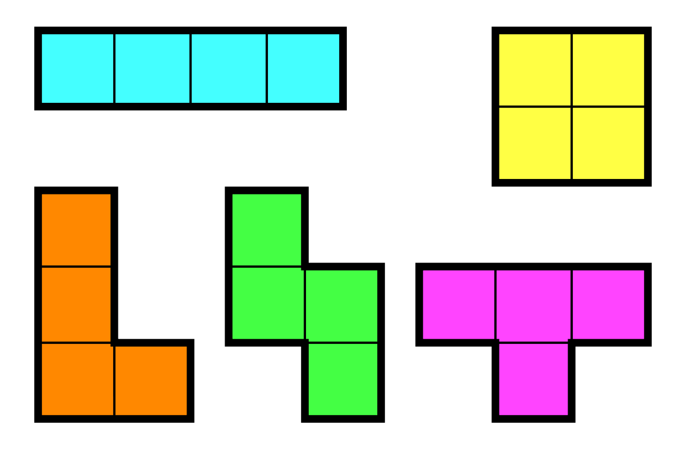

# Basic-Tetris with a Minimal Kernel
Playing tetris from a system call, implemented with a minimal kernel built in Dr. Gheiths CS:439 Operating Systems, modeled after a Linux Kernel with an i386 architectore.

## Keyboard Inputs and Enabling Keyboard Interrupts
### PS/2 Controller and Devices
The PS/2 Keyboard is a device that talks to a PS/2 controller (Intel 8042; AIP) using serial communication. The PS/2 Keyboard accepts commands and sends responses to those commands, and also sends scan codes indicating when a key was pressed or released to the PS/2 controller.

<strong>Hardware Overview: </strong>



##### Dual Channel PS/2 Controllers
Dual Channels PS/2 Controllers (like the one displayed above) support PS/2 style mice along with PS/2 keyboards. The first PS/2 connector (typically the keyboard) connects to PIC1 (Master PIC) through IRQ1. The Second PS/2 Controller (typically the mouse) talks to PIC2 (Slave PIC) through IRQ12, which cascades to PIC1 through IRQ2.

#### PS/2 Controller IO Ports
The PS/2 Controller itself uses 2 IO ports
|IO Port |	Access Type |	Purpose |
|--|--|--|
|0x60 |	Read/Write | 	Data Port |
|0x64 |	Read |	Status Register |
|0x64 |	Write |	Command Register |

##### The Data Port
Used for reading data received from a PS/2 device or from the PS/2 controller itself writing data to a PS/2 device or the controller itself
##### Status Register
The Status Register contains various flags that show the state of the PS/2 controller. The meanings for each bit are:
|Bit |	Meaning |
|--|--|
|0 |	Output buffer status (0 = empty, 1 = full) <br> (must be set before attempting to read data from IO port 0x60) |
|1 |	Input buffer status (0 = empty, 1 = full) <br> (must be clear before attempting to write data to IO port 0x60 or IO port 0x64) |
|2 |	System Flag <br> Meant to be cleared on reset and set by firmware (via. PS/2 Controller Configuration Byte) if the system passes self tests (POST) |
|3 |	Command/data (0 = data written to input buffer is data for PS/2 device, 1 = data written to input buffer is data for PS/2 controller command) |
|4 |	Unknown (chipset specific) <br> May be "keyboard lock" (more likely unused on modern systems) |
|5 |	Unknown (chipset specific) <br> May be "receive time-out" or "second PS/2 port output buffer full"|
|6 |	Time-out error (0 = no error, 1 = time-out error) |
|7 |	Parity error (0 = no error, 1 = parity error) |
##### Command Register  
The Command Port (IO Port 0x64) is used for sending commands to the PS/2 Controller (not to PS/2 devices).

The PS/2 Controller accepts commands and performs them. These commands should not be confused with bytes sent to a PS/2 device (e.g. keyboard, mouse).

To send a command to the controller, write the command byte to IO port 0x64. If there is a "next byte" (the command is 2 bytes) then the next byte needs to be written to IO Port 0x60 after making sure that the controller is ready for it (by making sure bit 1 of the Status Register is clear). If there is a response byte, then the response byte needs to be read from IO Port 0x60 after making sure it has arrived (by making sure bit 0 of the Status Register is set).

|Command Byte |	Meaning |	Response Byte|
|---|--|--|
|0x20 |	Read "byte 0" from internal RAM	|Controller Configuration Byte (see below)|
|0x21 | to 0x3F	Read "byte N" from internal RAM (where 'N' is the command byte & 0x1F)|	Unknown (only the first byte of internal RAM has a standard purpose)|
|0x60 |	Write next byte to "byte 0" of internal RAM (Controller Configuration Byte, see below)	|None|
|0x61 | to 0x7F	Write next byte to "byte N" of internal RAM (where 'N' is the command byte & 0x1F)	|None|
|0xA7 |	Disable second PS/2 port (only if 2 PS/2 ports supported)	|None|
|0xA8 |	Enable second PS/2 port (only if 2 PS/2 ports supported)	|None|
|0xA9 |	Test second PS/2 port (only if 2 PS/2 ports supported)	|0x00 test passed <br>0x01 clock line stuck low <br>0x02 clock line stuck high <br>0x03 data line stuck low <br>0x04 data line stuck high|
|0xAA |	Test PS/2 Controller	|0x55 test passed <br>0xFC  test failed|
|0xAB |	Test first PS/2 port	|0x00 test passed <br>0x01 clock line stuck low <br>0x02 clock line stuck high <br>0x03 data line stuck low <br>0x04 data line stuck high|
|0xAC |	Diagnostic dump (read all bytes of internal RAM)	|Unknown|
|0xAD |	Disable first PS/2 port	|None|
|0xAE |	Enable first PS/2 port	|None|
|0xC0 |	Read controller input port	|Unknown (none of these bits have a standard/defined purpose)|
|0xC1 |	Copy bits 0 to 3 of input port to status bits 4 to 7	|None|
|0xC2 |	Copy bits 4 to 7 of input port to status bits 4 to 7	|None|
|0xD0 |	Read Controller Output Port	|Controller Output Port (see below)|
|0xD1 |	Write next byte to Controller Output Port (see below)  <br>Note: Check if output buffer is empty first |None|
|0xD2 |	Write next byte to first PS/2 port output buffer (only if 2 PS/2 ports supported) <br> (makes it look like the byte written was received from the first PS/2 port) | None |
|0xD3 |	Write next byte to second PS/2 port output buffer (only if 2 PS/2 ports supported) <br>(makes it look like the byte written was received from the second PS/2 port) |None|
|0xD4 |	Write next byte to second PS/2 port input buffer (only if 2 PS/2 ports supported) (sends next byte to the second PS/2 port) | None|
|0xF0 to 0xFF |	Pulse output line low for 6 ms. Bits 0 to 3 are used as a mask (0 = pulse line, 1 = don't pulse line) and correspond to 4 different output lines. <br>Note: Bit 0 corresponds to the "reset" line. The other output lines don't have a standard/defined purpose. | None|
##### PS/2 Controller Configuration Byte
Commands 0x20 and 0x60 let you read and write the PS/2 Controller Configuration Byte. This configuration byte has the following format:
|Bit |	Meaning|
|--|--|
|0 |	First PS/2 port interrupt (1 = enabled, 0 = disabled)|
|1 |	Second PS/2 port interrupt (1 = enabled, 0 = disabled, only if 2 PS/2 ports supported)|
|2 |	System Flag (1 = system passed POST, 0 = your OS shouldn't be running)|
|3 |	Should be zero|
|4 |	First PS/2 port clock (1 = disabled, 0 = enabled)|
|5 |	Second PS/2 port clock (1 = disabled, 0 = enabled, only if 2 PS/2 ports supported)|
|6 |	First PS/2 port translation (1 = enabled, 0 = disabled)|
|7 |	Must be zero|
##### PS/2 Controller Output Port
Commands 0xD0 and 0xD1 let you read and write the PS/2 Controller Output Port. This output port has the following format:

|Bit|	Meaning|
|--|--|
|0|	System reset (output) <br>WARNING always set to '1'. You need to pulse the reset line (e.g. using command 0xFE), and setting this bit to '0' can lock the computer up ("reset forever").|
|1|	A20 gate (output)|
|2|	Second PS/2 port clock (output, only if 2 PS/2 ports supported)|
|3|	Second PS/2 port data (output, only if 2 PS/2 ports supported)|
|4|	Output buffer full with byte from first PS/2 port (connected to IRQ1)|
|5|	Output buffer full with byte from second PS/2 port (connected to IRQ12, only if 2 PS/2 ports supported)|
|6|	First PS/2 port clock (output)|
|7|	First PS/2 port data (output)|

##### Initializing the PS/2 Controller
* Disable Devices: Send to the PS/2 controller command 0xAD to disable the first connected device and command 0xA7 to disable the second connected device
* Flush The Output Buffer: read from the Data IO Port (0x60) until the output buffer status is clear 
* Set The Controller Configuration Byte:
  * Disable All IRQs (mask them) (Re-enable after controller initialized)
  * Read The Configuration Byte (command 0x20)
  * Disable Translation And Port Interrupts (clear bits 0, 1, and 6) (using command 0x60)
* Check If Dual Channel Controller: Test if bit 5 of the configuration byte was set, if it was clear then it can't be a "dual channel" PS/2 controller (because the second PS/2 port should be disabled)
* Test The PS/2 Controller: Send command 0xAA and poll for response. (0x55 indicates test passed)
* Perform Interface Test: Send command 0xAB to the test the first PS/2 connection and poll for response. (0x55 indicates test passed). If dual channel then send command 0xA9  to test the second PS/2 connection and poll for response. (0x00 indicates test passed)
* Enable Devices: Send command 0xAE to enable the first PS/2 connection. If dual channel then send command 0xA8 to enable the second PS/2 connection
* If using IRQs then enable interrupts by setting bit 0 and bit 1 in the configuration byte (reading with 0x20 then setting with 0x60)
* Reset Devices: All PS/2 devices support the "reset" command (a command for the device, not the controller). To send the reset send the byte 0xFF to the usable device. You should recieve two responses, the first, 0xFA, indicating the device recieved the request, and then the response from the request (0xAA indicates test passed)

##### Sending Bytes to Devices
Unfortunately, the PS/2 Controller does not support interrupt driven transmission (e.g. you can't have a queue of bytes waiting to be sent and then send each byte from inside a "transmitter empty" IRQ handler). Fortunately, little data needs to be sent to typical PS/2 devices and polling suffices.

<strong>First PS/2 Port</strong>
To send data to the first PS/2 Port:
* Set up some timer or counter to use as a time-out
* Poll bit 1 of the Status Register ("Input buffer empty/full") until it becomes clear* or until your time-out expires
* If the time-out expired, return an error
* Otherwise, write the data to the Data Port (IO port 0x60)

<strong>Second PS/2 Port</strong>
Sending data to the second PS/2 port is a little more complicated, as you need to send a command to the PS/2 controller to tell it that you want to talk to the second PS/2 port instead of the first PS/2 port. To send data to the second PS/2 Port:
* Write the command 0xD4 to IO Port 0x64
* Set up some timer or counter to use as a time-out
* Poll bit 1 of the Status Register ("Input buffer empty/full") until it becomes clear, or until your time-out expires
* If the time-out expired, return an error
* Otherwise, write the data to the Data Port (IO port 0x60)

The function below can achieve both and recieve a single response. Note: no timer or counter is used to time-out so will infinitely run if not properly handled
```C++
// next_byte == 0 if no next_byte to send
// response == nullptr if no response to recieve 
static void send_command(unsigned char command_byte, unsigned char next_byte, unsigned char* response) {
    outb(0x64, command_byte); // send command_byte to Command IO Port (0x64)
    if (next_byte) {
        poll_write(); // while((inb(0x64) & 0x2));
        outb(0x60, next_byte); // send next_byte to Data IO Port (0x60)
    }
    if (response != nullptr) {
        poll_read(); // while(!(inb(0x64) & 0x1));
        *response = inb(0x60); // responses recieved via Data IO Port (0x60)
    }
}
```

#### Scancode Translation
Once we eventually enable keyboard interrupts we'll be recieving scan codes from the keyboard when a user presses a key. We'll translate these scan codes into ASCII to more easily print characters to the screen once we also implement that. Typically, PS/2 keyboards will send scan codes from Scan Code Set 2 (Introduced with the IBM PC AT). One could use these but we opt to convert them to Scan Code Set 1 via translation through the PS/2 Controller by flipping bit 6 in the configuration byte. Thus in our handler we'll be recieving Scan Code Set 1 scan codes which we can map to ascii characters and/or other things. The state of the keyboard that will be kept consist of:
```C++
class Keyboard {
    bool caps;                        // 1 if CapsLock toggled, 0 otherwise
    bool scroll;                      // 1 if ScrollLock toggled, 0 otherwise
    bool num;                         // 1 if NumLock toggled, 0 otherwise
    uint8_t shift;                    // 0x1 if left shift pressed, 0x2 if right shift pressed, 0 otherwise
    uint8_t ctrl;                     // 1 if ctrl is pressed
    uint8_t keys[256];                // 1:1 mapping of the keys 
    uint8_t kb_queue[BUFF_LEN];       // queue continuously updating/storing ASCII values pressed
    uint8_t head;                     // head of the kb_queue
    uint8_t tail;                     // tail of the kb_queue

    //...
}
```
Now in the handler we'll enter via interrupts we can manipulate this state as the keyboard state dynamically changes. Converting to ASCII simply means storing a mapping of Scan Code Set 1 : ASCII character and then using the scan code as an index. To check if a key has been released you can perform a simple check like `byte & 0x80` where byte is the scan code send to the handler. This is because in Scan Code Set 1, when a key is released it will send `0x80 | <scan code for key being released>` as a scan code. So then your handler can look something akin to

```C++
void Keyboard::handle_interrupt() {
    // the current key being pressed
    unsigned char byte = inb(0x60);

    // key release 
    if(byte & 0x80) {
        // check if one of the toggle keys and adjust state
        ...
    } else {
        // key being pressed, check if toggle keys and adjust state
        ...
        // map to ascii value, store in queue
        ...
    }

}
```

### Interrupts with PS/2 Devices
When IRQ1 occurs you just read from IO Port 0x60 (there is no need to check bit 0 in the Status Register first), send the EOI (0x20) to the interrupt controller and return from the interrupt handler. You know that the data came from the first PS/2 device connected because you received an IRQ1.

When IRQ12 occurs you read from IO Port 0x60 (there is no need to check bit 0 in the Status Register first), send the EOI (0x20) to the interrupt controller/s and return from the interrupt handler. You know that the data came from the second PS/2 device connected because you received an IRQ12.

Unfortunately, there is one problem to worry about. If you send a command to the PS/2 controller that involves a response, the PS/2 controller may generate IRQ1, IRQ12, or no IRQ (depending on the firmware) when it puts the "response byte" into the buffer. In all three cases, you can't tell if the byte came from a PS/2 device or the PS/2 controller. In the no IRQ case, you additionally will need to poll for the byte. Fortunately, you should never need to send a command to the PS/2 controller itself after initialisation (and you can disable IRQs and both PS/2 devices where necessary during initialisation).

#### The IOAPIC 
The IOAPIC has a set of 3x 32-bit registers and various 64-bit registers (one per IRQ)
* IOAPICID Register 0x00 (32-bit register) : Get/set the IO APIC's id in bits 24-27. All other bits are reserved.
* IOAPICVER Register 0x01 (32-bit register) : Get the version in bits 0-7. Get the maximum amount of redirection entries in bits 16-23. All other bits are reserved. Read only.
* IOAPICARB Register 0x03 (32-bit register) : Get the arbitration priority in bits 24-27. All other bits are reserved. Read only.
* IOREDTBL 0x10 to 0x3F (64-bit registers) : Contains a list of redirection entries. They can be read from and written to. Each entries uses two addresses, e.g. IRQ1 corresponds to 0x12 and 0x13
  * Each Entry consists of the following
    | Field	| Bits|	Description| 
    | ----------- | ----------- | --------- |
    | Vector	| 0 - 7| 	The Interrupt vector that will be raised on the specified CPU(s).| 
    | Delivery Mode	| 8 - 10| 	How the interrupt will be sent to the CPU(s). It can be 000 (Fixed), 001 (Lowest Priority), 010 (SMI), 100 (NMI), 101 (INIT) and 111 (ExtINT). Most of the cases you want Fixed mode, or Lowest Priority if you don't want to suspend a high priority task on some important Processor/Core/Thread.| 
    | Destination Mode	| 11| 	Specify how the Destination field shall be interpreted. 0: Physical Destination, 1: Logical Destination| 
    | Delivery Status	| 12| 	If 0, the IRQ is just relaxed and waiting for something to happen (or it has fired and already processed by Local APIC(s)). If 1, it means that the IRQ has been sent to the Local APICs but | it's still waiting to be delivered.| 
    | Pin Polarity	| 13| 	0: Active high, 1: Active low. For ISA IRQs assume Active High unless otherwise specified in Interrupt Source Override descriptors of the MADT or in the MP Tables.| 
    | Remote IRR	| 14| 	TODO| 
    | Trigger Mode	| 15| 	0: Edge, 1: Level. For ISA IRQs assume Edge unless otherwise specified in Interrupt Source Override descriptors of the MADT or in the MP Tables.| 
    | Mask	| 16|	Just like in the old PIC, you can temporary disable this IRQ by setting this bit, and reenable it by clearing the bit.| 
    | Destination	| 56 - 63| 	This field is interpreted according to the Destination Format bit. If Physical destination is choosen, then this field is limited to bits 56 - 59 (only 16 CPUs addressable). You put here the APIC ID of the CPU that you want to receive the interrupt. TODO: Logical destination format...| 

##### Reading and Writing from/to the IOAPIC

The registers are memory indexed meaning the IOAPIC actually only has 2x 32-bit registers called IOREGSEL and IOREGWIN that you fetch/set and retrieve from. To fetch/set one of registers listed above you set IOREGSEL with the register index and read/write from IOREGWIN like so:
```C++
uint32_t Config::readIOApic(uint32_t reg) {
   uint32_t volatile *ioapic = (uint32_t volatile *)kConfig.ioAPIC;
   ioapic[0] = (reg & 0xff); // set IOREGSEL using bottom 8 bits for register select
   return ioapic[4]; // fetch from IOREGWIN
}

void Config::writeIOApic(uint32_t reg, uint32_t value) {
   uint32_t volatile *ioapic = (uint32_t volatile *)kConfig.ioAPIC;
   ioapic[0] = (reg & 0xff); // set IOREGSEL using bottom 8 bits for register select
   ioapic[4] = value; // set IOREGWIN
}
```
#### Creating a Redirection Entry in the IOAPIC
Typically the IOREDTBL is mapped to the IRQs (legacy or PCI) during startup using the APIC's MADT/APIC table. But in our mininal kernel we will need to create the entry ourselves. We simply need to create a 64-bit entry via 2x 32-bit quantities and write them to the IOAPICS 0x12 and 0x13 registers (which correspond to IRQ1, the lane our PS/2 keyboard (through the controller) communicates on). We will map the IRQ1 lane to the Interrupt Vector to 0x9 and create an entry in the IDT with this interrupt vector for the CPU later. The other entries can all stay at their default meaning when 0. Lastly we need to ensure the mask bit is cleared in order to the IOAPIC to start listening to that lane. Thus our 64-bit entry becomes:
`0000000000000000000000000000000000000000000000000000000000001001 == 0x0000000000000009`
(the first 8 bits indicate the interrupt vector the IOAPIC will send to the CPU, the rest take on their default value when 0, bit 16 the mask bit must also be 0).

Putting this entry into the IOREDTBL consists of writing the lower 32-bits into the IOAPIC register 0x12, and the upper 32-bits into 0x13, corresponding to IRQ1. This code would effectively achieve such:
```C++
Config::writeIOApic(0x12, 0x00000009);
Config::writeIOApic(0x13, 0x00000000);
```
Now any interrupts sent across the IRQ1 line (i.e. the line our PS/2 Controller is communicating across) will make the IOAPIC will raise an interrupt with interrupt vector 0x9 for the CPU to handle.

### Setting the IDT



The last step is to write a handler to process the keyboard interrupt and set the correct index in the IDT to point to this handler. Since we programmed the IOAPIC to raise 0x9 as the interrupt vector, this will be the value the CPU eventually ends up indexing the IDT with, so we will use that as the index into the IDT and then set a pointer to our handler like so.
```C++
IDT::interrupt(0x9, (uint32_t)keyboardHandler_);
```

#### Sending EOI in the Handler
You need to send an EOI (end of interrupt) to the PIC to indicate that we have finished processing the interrupt it raised. (An EOI is used to cause a PIC to clear the corresponding bit in the In Service Register (ISR), and thus allow more interrupt requests of equal or lower priority to be generated by the PIC.) like so:
`SMP::eoi_reg.set(0);` where the offset for the EOI register is `0b0h`


Sources and References: 
* https://wiki.osdev.org/PS2_Keyboard
* https://wiki.osdev.org/APIC
* https://wiki.osdev.org/IOAPIC
* https://github.com/knusbaum/kernel/blob/master/keyboard.c


## Writing to VGA Memory
For standard VGA video modes the video memory will be at address `0xA0000` for EGA/VGA video modes and `0xB8000` for CGA and text modes. Some basic video modes and their specs are defined below.
|Mode Number|Mode |WxHxD|
|--|--|--|
|00|	text |40$\times$25$\times$16$\times$2 (B/W text)|
|01|	text |40$\times$25$\times$16 |
|02|	text |80$\times$25$\times$16 (Gray text)|
|03|	text |80$\times$25$\times$16 |
|04|	CGA |320$\times$200$\times$4 |
|05|	CGA |320$\times$200$\times$4|
|06|	CGA |640$\times$200$\times$2 |
|07|	MDA monochrome text |80$\times$25 Monochrome text|
|08|	PCjr|160$\times$200$\times$16|
|09|	PCjr|320$\times$200$\times$16|
|0A|	PCjr|640$\times$200$\times$16|
|0B|	reserved||
|0C|	reserved||
|0D|	EGA |320 $\times$200$\times$ 16 |
|0E|	EGA |640$\times$200$\times$16 |
|0F|	EGA |640$\times$350 Monochrome graphics|
|10|	EGA |640$\times$350$\times$16 |
|11|	VGA |640$\times$480$\times$2|
|12|	VGA |640$\times$480$\times$16 |
|13|	VGA |320$\times$200$\times$256 |

We wish to switch into VGA mode 13 which is a relatively easy-to-use mode as the screen is effectively mapped linearly to memory for this mode. (Conversely to mode 12)


#### Switching Video Modes
To switch video modes we will use a BIOS interrupt (`int 0x10`) with 0 in the `%ah` regiser and with the desired video mode number in the `%al` register. 
##### Bootloader Code
We can only use BIOS Interrupts in a 16-bit environment which limits us to being in Real Mode or Virtual 8086 Mode. We opt for the former as the latter requires some other special conditions. Thus in the bootloader before we switch to protected mode we insert this code to enter into Video Mode 13 (320$\times$200$\times$256):

```assembly
movb $0x00, %ah 
movb $0x13, %al
int $0x10
```

#### Writing to VGA Memory
Now that were in the correct video mode, we can simply write to VGA Memory, which for our Mode is located at `0xA000`, to display colors on the screen. The color displayed depends on the byte value written to memory. 

##### Mode 13 VGA Colors
  

#### Plotting Pixels

The screen is 320 pixels in width and 200 pixels in height. This is mapped 0 to 319 on the x axis and 0 to 199 on the y axis, with the origin (0,0) at the top-left corner. Since this is a 256-color mode, each pixel represents 8 bits or one byte, so the memory needed is 320$*$200 or 64,000 bytes. Since memory is linear, the offset into computer memory must be calculated to plot a pixel. To do this the y value is multiplied by the width of the screen, or 320, and the x value is added to that:
```C++
uint32_t offset(uint32_t x, uint32_t y) {
    return x + (y << 8) + (y << 6);
}
```

Then plotting a pixel simply becomes:
```C++
void plot(uint32_t x, uint32_t y, Color color, uint8_t *double_buffer) {
    if (double_buffer != nullptr) {
        double_buffer[offset(x, y)] = color;
    } else {
        VGA[offset(x, y)] = color;
    }
}
```

Where `double_buffer`, is a optimization technique explained below. Color is just a enumerated `uint8_t` type, and x, y as it suggests is the `(x, y)` cartesian coordinates on the screen. Where `(0, 0)` is the top left corner of the screen and `y` increases positively the lower on the screen you are, and `x` increases positivlely the more right on the screen you are.

#### Optimizations
Some optimizations should be done to make writing to VGA memory more practical.

##### Bresenham's Line Algorithm
An efficient way to draw a line using mainly addition and subtraction. 

##### Shifting
A way to further speed up pixel plotting is to use shifting instead of multiplication when calculating the offset. 

##### Double Buffering
Double Buffering is a fairly simple concept to grasp. Instead of drawing directly to video memory, the program draws everything to a double buffer (Figure 20a). When finished, the program copies the double buffer to video memory all at once (Figure 20b). At that point the program clears the double buffer (if necessary) and the process starts over:

<dl class="image">
    <dt>
      
    </dt>
    <dd>
    </dd>
  </dl>

#### Writing Text in VGA Mode
Once in graphic mode, you no longer have the BIOS or the hardware to draw fonts for you. Thus we have to draw the characters pixel by pixel to the screen. Which can be tedious but is eased with bit maps.

##### PSF File
On every Linux distributions, you can find a lot of console fonts with the extension .psf or .psfu, which store bitmap glyphs of characters. They can be found in `/usr/share/kbd/consolefonts/`.
There are 2 versions of PSF, indicated by the magic number at the start of the file, but for this example we'll just use the PSF1, like the default one in the code, and like the ones in the directory specified. The PSF1 format is as follows:
``` C++
typedef struct {
    uint8_t magic[2]; // 0x36 and 0x04
    uint8_t mode; // how many character in file and if there is unicode info     
    /* 0 : 256 characters, no unicode_data 
       1 : 512 characters, no unicode_data 
       2 : 256 characters, with unicode_data 
       3 : 512 characters, with unicode_data 
    */                                                                  
    uint8_t height; 
} PSF_font;
```

The PSF1 format has a constant width of 8 bytes, which is one of the main differences from the PSF2 version which has a variable width.

##### Example Glyph
Here is what a glyph would look like for the character `A` with a height of 16. Each bit in the glyph describes a pixel on the screen. When you see a 1 you color in a specified color, otherwise you can leave the background transparent or color it a specified background color. 
```
00000000  byte  0
00000000  byte  1
00000000  byte  2
00010000  byte  3
00111000  byte  4
01101100  byte  5
11000110  byte  6
11000110  byte  7
11111110  byte  8
11000110  byte  9
11000110  byte 10
11000110  byte 11
11000110  byte 12
00000000  byte 13
00000000  byte 14
00000000  byte 15
```

##### PSF to ELF
We'll be convering PSF to an ELF object file to link with the kernel and be able to parse it

```bash
objcopy -O elf32-i386 -B i386 -I binary font.psf font.o
readelf -s font.o
 
Symbol table '.symtab' contains 5 entries:
   Num:    Value          Size Type    Bind   Vis      Ndx Name
     0: 0000000000000000     0 NOTYPE  LOCAL  DEFAULT  UND 
     1: 0000000000000000     0 SECTION LOCAL  DEFAULT    1 
     2: 0000000000000000     0 NOTYPE  GLOBAL DEFAULT    1 _binary_font_psf_start
     3: 0000000000008020     0 NOTYPE  GLOBAL DEFAULT    1 _binary_font_psf_end
     4: 0000000000008020     0 NOTYPE  GLOBAL DEFAULT  ABS _binary_font_psf_size
```

##### Drawing a Char
Now, drawing a char on the screen then simply becomes:
```C++
void put_char(uint16_t index, uint32_t cx, uint32_t cy, Color fg, Color bg, uint8_t *double_buffer) {
    // get the glyph for the index. If there's no glyph for a given index, we'll use the first glyph 
    unsigned char *glyph = offset(index);
    // map top left pixel of bitmap to pixel (x,y) coordinates 
    uint32_t x = cx * char_width;
    uint32_t y = cy * char_height;
    int mask[8] = {128, 64, 32, 16, 8, 4, 2, 1};
    // finally display pixels according to the bitmap 
    for(uint32_t py = 0; py < char_height; py++) {
        for(uint32_t px = 0; px < char_width; px++) {
            Color color = bg;
            if ((glyph[py]) & mask[px]) {
                color = fg;
            }
            plot(px + x, py + y, color, double_buffer);
        }
    }
}
```

Instead of always writing a background color you can also use a variation of this function with a transparent background.

```C++
void put_char(uint16_t index, uint32_t cx, uint32_t cy, Color fg, uint8_t *double_buffer ) {
    // get the glyph for the index. If there's no glyph for a given index, we'll use the first glyph 
    unsigned char *glyph = offset(index);
    // map top left pixel of bitmap to pixel (x,y) coordinates 
    uint32_t x = cx * char_width;
    uint32_t y = cy * char_height;
    int mask[8] = {128, 64, 32, 16, 8, 4, 2, 1};
    // finally display pixels according to the bitmap 
    for(uint32_t py = 0; py < char_height; py++) {
        for(uint32_t px = 0; px < char_width; px++) {
            if ((glyph[py]) & mask[px]) {
                plot(px + x, py + y, fg, double_buffer);
            }
        }
    }
}
```

And a simplistic version of printing a string across the screen could be: Which could be expanded with a stored cursor to continously write from the top left of the screen to the bottm right.
```C++
void put_string(const char* str, uint32_t cx, uint32_t cy, Color fg, Color bg, uint8_t *double_buffer) {
    uint32_t cx_offset = cx;
    while(*str != 0) {
        if (*str == '\n') {
            cy++;
            cx_offset = cx;
            str++;
        } else {
            put_char(*str++, cx_offset++, cy, fg, bg, double_buffer);
        }
    }
}
```

###### Outcome



Sources and References:
* https://wiki.osdev.org/Drawing_In_Protected_Mode
* http://web.archive.org/web/20140218012818/http://atschool.eduweb.co.uk/camdean/pupils/amac/vga.htm#7, http://www.brackeen.com/vga/basics.html
* https://wiki.osdev.org/Drawing_In_Protected_Mode
* https://wiki.osdev.org/VGA_Fonts
* https://git.kernel.org/pub/scm/linux/kernel/git/legion/kbd.git/tree/src/psf.h?id=6613abc26a853293c12f4e146a27606f02c8dd03

## Tetris
Now that we have keyboard interrupts and VGA mode, we can effectively program tetris

### Tetromino
Each Tetromino (tetris piece) is made up of sub "blocks" that we are defining to be 4 x 4 pixels. 



Thus the 'I' piece consist is 16 $\times$ 4 when placed vertically. Or 4 $\times$ 16 when placed horizontally (and as it looks in the picture above)

Every piece can be in one of four possible rotation orientations that can change depending on a key pressed by the player and the overall goal of the game is to survive as long as you can as the pieces fall down from the top of screen into a container and the only way to rid yourselves of them is to make a line of blocks stretching across the entire width of the container.

For our game the pieces will move an entire block size per game tick, meaning it moves down automatically about 4 pixels every game tick. A game tick consists of 1000 many PIT increments, which roughly corresponds to one second. 

The logic of moving the pieces is fairly simple each piece can either move left, down, or right, and each piece can rotate. 

Our generic shape class stores the (x, y) coordinates of the upper left pixel for each shape (in 2 $\times$uint32_t), as well as the type of tetrimino (in a char), the orientation (uint8_t) and defines some other useful constants and virtual methods (`move_left`, `move_down`, `move_right`, `rotate()`) that each tetrimino shape must implement.

Then we just need to run a game loop that looks similar to this:
```C++
void play_game() {
    // between every GT number of jiffies, we'll force a call to move_down() on the shape
    volatile uint32_t time_drop = Pit::jiffies + GT;
    while(true) {
        if (Pit::jiffies >= time_drop) {
            bool moved_down = move(DOWN);
            if (!moved_down) {
                // drop next shape if hits bottom
                next_shape();
            }
            
            time_drop = Pit::jiffies + GT;
        }
        // continously check the queue for keys input by the user, queue is filled via keyboard interrupts
        uint8_t control_input = get_control();
        move(control_input);
    }
}
```
